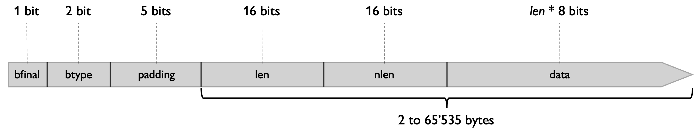
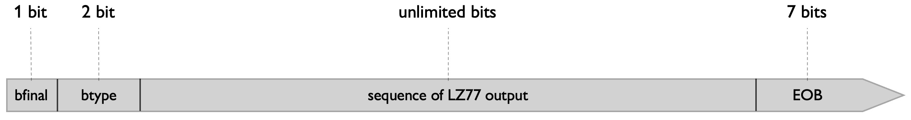
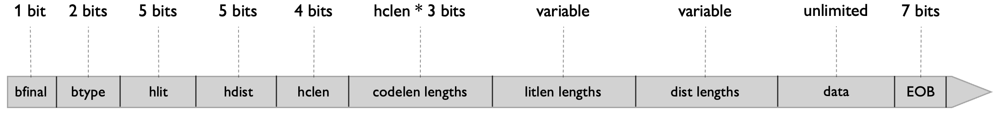

# Deflate - Recap

In this document, I want to give you an easy accessible reference sheet for Deflate. Included are all different block type specifications, all pre-defined Huffman codebooks, and all lookup tables, and the order of "codelen" lengths that is specified for the Dynamic Huffman compressed block in RFC1951.

Additionally, in this document you will find at the bottom the reference to - in my opinion - the best Deflate implementation written in C. I provide you instructive hints that enable you to navigate and understand the rather complex codebase more easily. I hope you have fun!

## Blocks

Block types are identified by their 3-bit headers:
* Bit 1: "bfinal" - indicates whether the current block is the last block of the input stream.
* Bit 2-3: "btype" - indicates which block type the current type is.

### Block types

With 2 bits "btype" we can define 4 different block types, which are the following:

  
"00": Non-compressed block

  

  
"01": Static Huffman compressed block

  

  
"10": Dynamic Huffman compressed block

  

  
"11": Reserved

  Don't use it!

## Pre-defined Huffman codebooks

  
Litlen Codebook

  | Month    | Savings |
  | -------- | ------- |
  | January  | $250    |
  | February | $80     |
  | March    | $420    |

## Lookup tables

## Codelen lengths order

  
Codelen

  The canonical Huffman code "Codelen" is used for decoding the litlen and dist length values from the <em>Deflate</em> input stream.
  When reading "hclen"-amount of 3-bit "codelen" values, the 3-bit values correspond to length values that are specified by this order, that is hard-coded into the de-/compressor,    i.e. the program itself. The order specifies 19 unique length values. If according to "hclen" we need to read less than those 19 "codelen" values, that means that we read the 
  value for the first "hclen"-amount of length values. The remaining length values then default to being zero.

  ##### Codelen lengths order:
  16, 17, 18, 0, 8, 7, 9, 6, 10, 5, 11, 4, 12, 3, 13, 2, 14, 1, 15
  

## Deflate implementation

