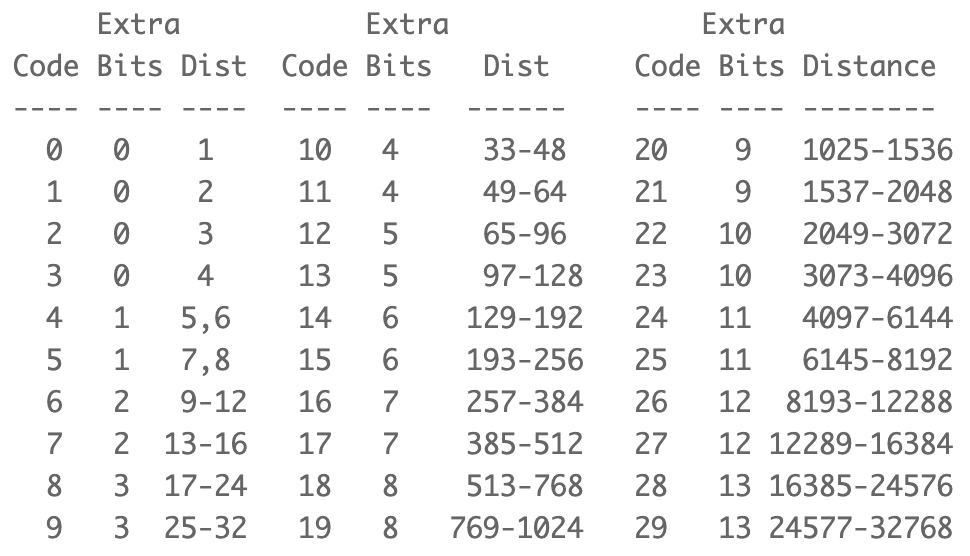

# Deflate - Recap

In this document, I want to give you an easy accessible reference sheet for Deflate. Included are all different block type specifications, all pre-defined Huffman codebooks, and all lookup tables, and the order of "codelen" lengths that is specified for the Dynamic Huffman compressed block in RFC1951.

Additionally, in this document you will find at the bottom the reference to - in my opinion - the best Deflate implementation written in C. I hope you have fun looking through it!

## Blocks

Block types are identified by their 3-bit headers:
* Bit 1: "bfinal" - indicates whether the current block is the last block of the input stream.
* Bit 2-3: "btype" - indicates which block type the current type is.

### Block types

With 2 bits "btype" we can define 4 different block types, which are the following:

  
"00": Non-compressed block

  

  Example: When we want to decompress a non-compressed block, we have to read the 3-bit header either “000” or “100”. Then we advance to the next byte boundary, and we read the next 2 
  bytes “len” and next 2 bytes “nlen”. If the inverse of “len” equals “nlen”, then we can proceed by just copying the next “len” bytes to the output. No decompressen needs to be done, 
  and by that, we are done with decompressing this non-compressed block.

  
"01": Static Huffman compressed block

  

  Example: Let’s ssume we have the input stream with the content: 001110101010110011011...<7-bits-for-EOB-marker>.
  The 3-bit header indicates, that this block is not the last block, and that the block type is a static huffman compressed block. Then, the first thing the decoder does, is to build 
  the litlen table with the codewords, and the lookup table. Then he would read from the input stream as many bits, until he finds 
  a match in the litlen codebook. The match is "1101010", which is mapped to the litlen value of 277. Now he knows, that value is a pointer length. Therefore, he looks up the base- 
  length and the extra bits in the lookup table. The decoder sees, that to the litlen value 277 is assigned a base-length of 67, and 4 extra bits. Therefore, he reads the next 4 bits 
  "1011", interprets them as the integer number 11, and performs the addition of 67 and 11. Now he has the pointer length of 78 bytes, meaning that the back reference is 78 bytes long.   Then he reads the next 5 bits, decodes them as a Dist value of 6. Then he looks up the base-distance of 9 plus 2 extra bits ("11" = 3) which ends up in a pointer distance of 12. Then 
  he replaces the pointer(length, distance) with the actual literal from the deflate stream.
  From there, the decoder continues, interpreting all the content, until he reacher the EOB marker.
  

  
"10": Dynamic Huffman compressed block

  
  

  When it comes to decompressing dynamic Huffman compressed blocks, first we have to 
  get the number of length values that should be read from the deflate-stream: 
  "hlit", "hdist", "hclen". Note: For these values, note the addition that needs to 
  be performed as specified above. Next, read as many "codelen codeword lengths" 
  from the stream, as specified in "hclen". Those values are all of length 3 bits, 
  meaning that the longest codelen codeword length can be maximum 7 bits. Note: See 
  further below the instructions about how to decode "codelen lengths", using the 
  predefined order. Now, we can derive the codelen codebook, which is used to decode 
  the litlen and dist length values that are stored after the codelen length values 
  in the deflate-stream. This allows us to also derive the litlen and dist 
  codebooks. Now, with both codebooks decoded, we can start decompressing the "data" 
  literals and pointer as usual. We will do that until we encounter the litlen value 
  for the EOB maker.

  
"11": Reserved

  Don't use it!

## Pre-defined Huffman codebooks & lookup tables

  
Litlen Codebook & lookup table

  
  

  
Dist Codebook & lookup table

  
  

## Codelen lengths order

  
Codelen

  The canonical Huffman code "Codelen" is used for decoding the litlen and dist length values from the <em>Deflate</em> input stream.
  When reading "hclen"-amount of 3-bit "codelen" values, the 3-bit values correspond to length values that are specified by this order, that is hard-coded into the de-/compressor,    i.e. the program itself. The order specifies 19 unique length values. If according to "hclen" we need to read less than those 19 "codelen" values, that means that we read the 
  value for the first "hclen"-amount of length values. The remaining length values then default to being zero.

  ##### Codelen lengths order:
  16, 17, 18, 0, 8, 7, 9, 6, 10, 5, 11, 4, 12, 3, 13, 2, 14, 1, 15
  

## Deflate implementation

[Hans Wennborg](https://www.hanshq.net/zip.html): Scroll down to "Build Instructions", download the .zip folder, and build the project by executing the command described for your corresponding operating system.

